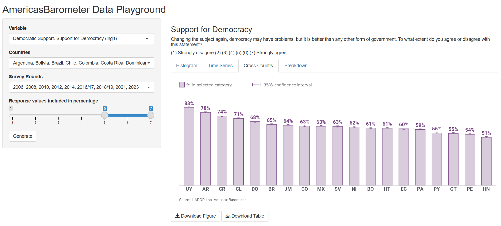

```{r setup, include=FALSE}
knitr::opts_chunk$set(echo = FALSE)
```

## LAPOP Data Playground

I am the developer of LAPOP's new Data Playground, an interactive data visualization tool created in RShiny.    

**Links:** [Data Playground](https://centerforglobaldemocracy.shinyapps.io/lapop-shiny/
) | [Source Code](https://github.com/lapop-central/lapop-shiny)


I previously worked as a contributor and manager of an older version in Tableau.  

**Version 1.0:** [Tableau Dashboard](https://public.tableau.com/app/profile/lapop.central/viz/LAPOPV3_2/Combination?publish=yes) | [Source Code](https://github.com/vanderbilt-data-science/lapop-dashboard/tree/remove-label-numbers)

## `lapop` R package

I am the creator and manager of the `lapop` R package, which automates the process of creating a variety of graphs using LAPOP data and formatting standards. 

**Links:** [Source Code](https://github.com/lapop-central/lapop-viz)


