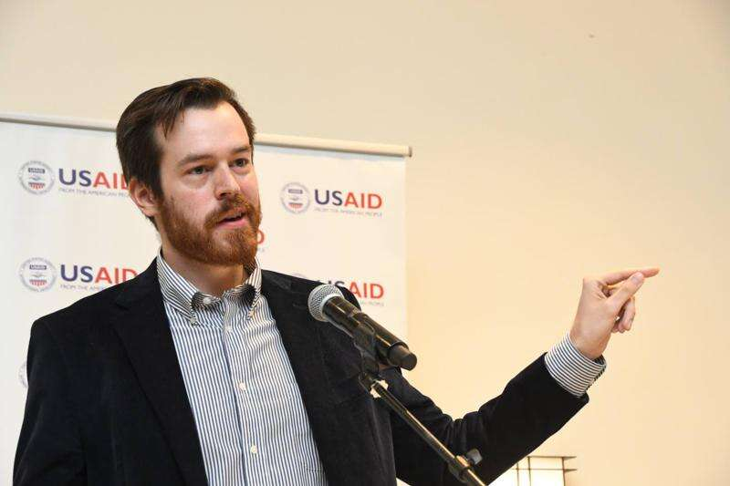

```{r setup, include=FALSE}
knitr::opts_chunk$set(echo = FALSE)
```

## 2024

Authored three full-length reports detailing survey results from the Caribbean.  

### [LAPOP’s AmericasBarometer takes the Pulse of Democracy in Jamaica 2023](https://www.vanderbilt.edu/lapop/jamaica/ABJAM2023-Pulse-of-democracy-final-20240703.pdf)

### [LAPOP’s AmericasBarometer takes the Pulse of Democracy in The Bahamas 2023](https://www.vanderbilt.edu/lapop/bahamas/ABBHS2023-Pulse-of-Democracy-20240531.pdf)

### [LAPOP’s AmericasBarometer takes the Pulse of Democracy in Suriname 2023](https://www.vanderbilt.edu/lapop/suriname/ABSUR2023-Pulse-of-Democracy-final-20240529.pdf)




## 2022

### [Telephone Sampling in the 2021 AmericasBarometer](https://www.vanderbilt.edu/lapop/insights/IMN009en.pdf)

Methodological note describing LAPOP's sampling strategy for the 2021 AmericasBarometer.

### [The Political Culture of Democracy in Jamaica and in the Americas, 2021: Taking the Pulse of Democracy](https://www.vanderbilt.edu/lapop/jamaica/AB2021JAM-Country-Report-English-Final-220411.pdf)

2021 survey report from Jamaica received coverage from local media including [The Jamaica Observer](https://www.jamaicaobserver.com/news/corruption-contradiction/), [Nationwide Radio](https://nationwideradiojm.com/59-of-jamaicans-believe-the-islands-elite-can-buy-elections/), and [The Jamaica Gleaner](https://jamaica-gleaner.com/article/commentary/20220614/editorial-dr-clarkes-ministerial-bull).  

### [Pulse of Democracy](https://www.vanderbilt.edu/lapop/ab2021/2021_LAPOP_AmericasBarometer_2021_Pulse_of_Democracy.pdf)

Spotlight report on support for coups in Brazil (p. 54), in addition to co-authored pieces on the economic impact of COVID (p. 28-29) and trust in elections in the Dominican Republic (p. 50-51). 

### [Would Americans ever support a coup? 40 percent now say yes.](https://www.washingtonpost.com/politics/2022/01/06/us-coup-republican-support/)


Co-authored piece in the Washington Post describing results of a survey gauging support for military coups among Americans.  


## 2021

### [Pandemic Concern, Democratic Stress, and Methodological Innovation in LAPOP’s 2020 “Off-Cycle” Studies: An Executive Summary Report](https://www.vanderbilt.edu/lapop/insights/IO947en.pdf)

Executive summary of four surveys conducted in 2020.  
